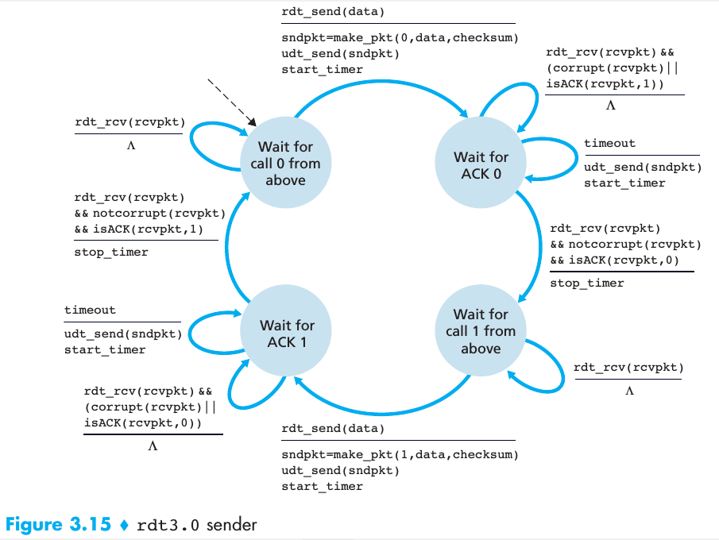
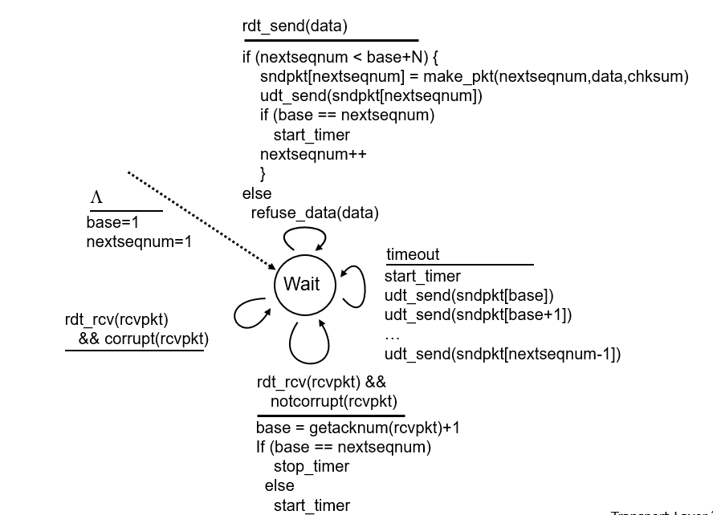
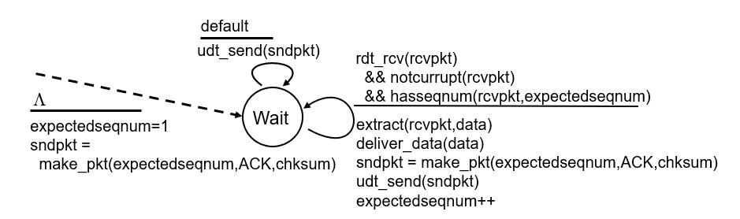
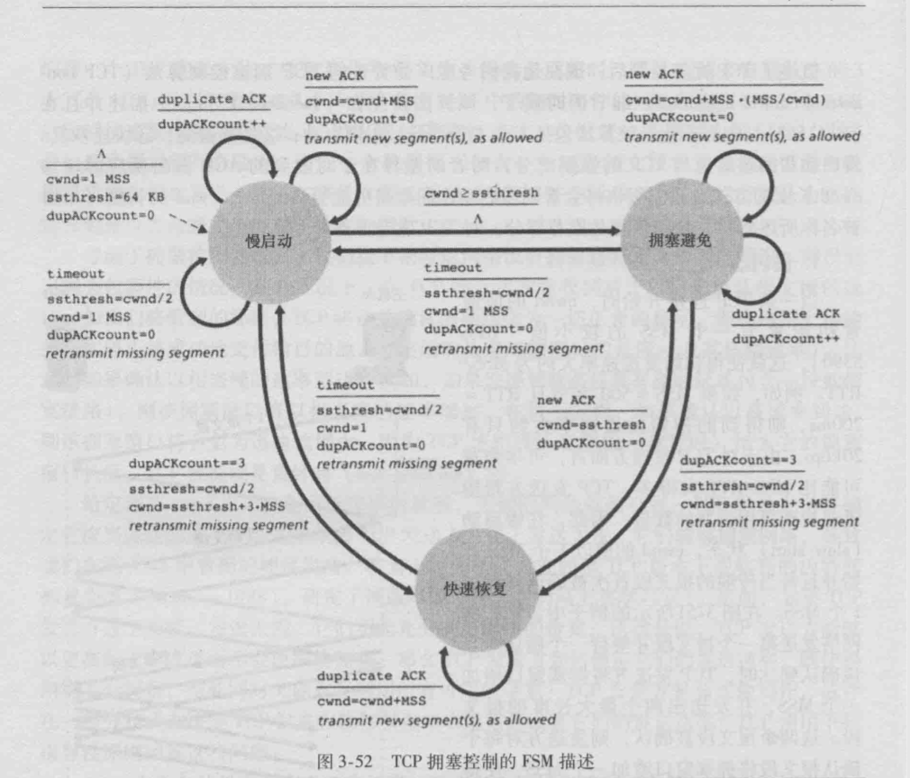
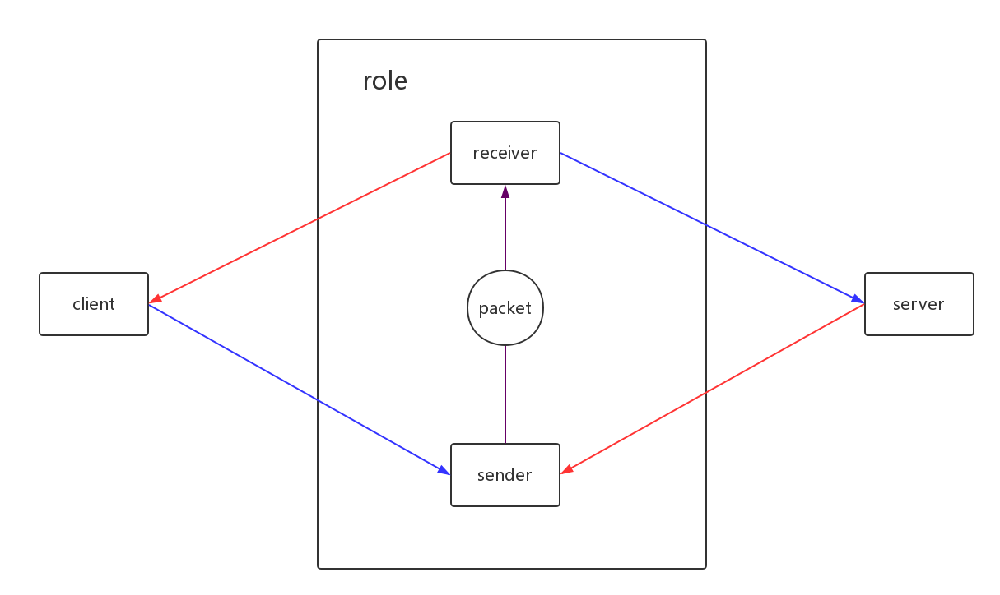
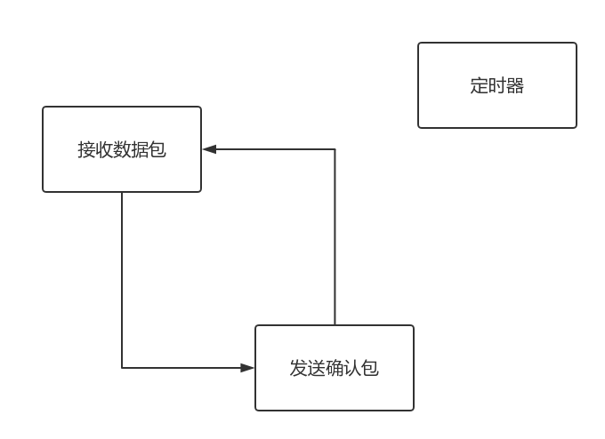
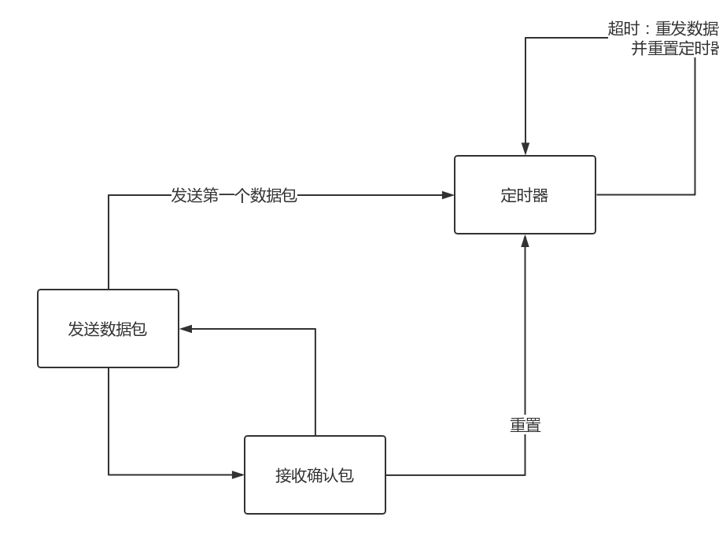
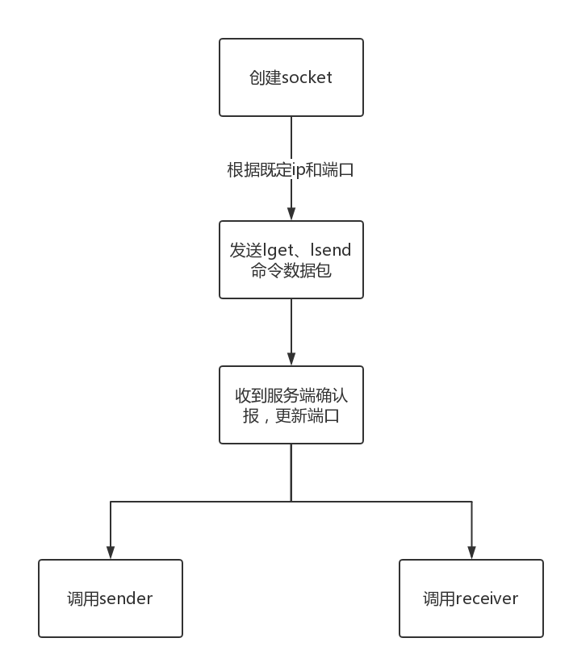
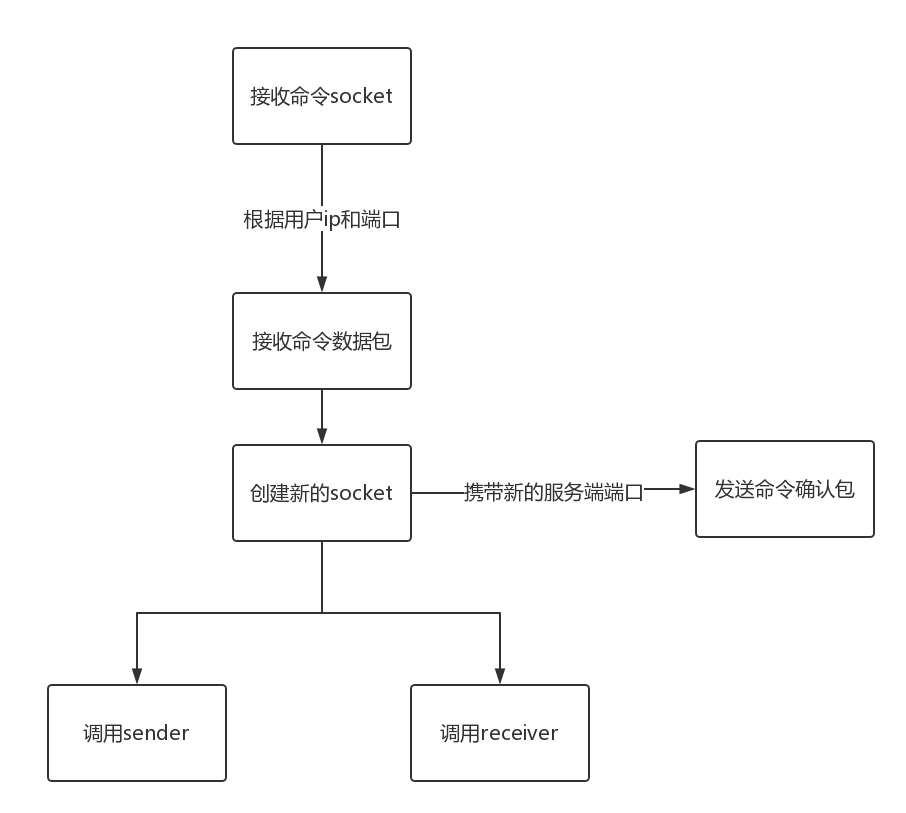

[TOC]

# LFTP-设计文档

## 功能设计

### 流水线可靠数据传输

- 基于rdt3.0实现流水线：将报序号进行扩展

  - 发送方状态机

    

  - 接收方状态机

  1. 包序号：在接收方、发送方分别维护seq，可以从1开始自增；
  2. 差错校验：待实现；
  3. 超时时间：设置为1s。
     - 开启计时线程，在此线程中获取当前时间，并用计时器开始时间值的差值与timeout作比较；
     - 超时的话进行重发，并重置定时器；

### 差错恢复：Go Back N

- 滑动窗口协议（GBN协议）

  - 发送方状态机

    

  - 接收方状态机

    

  1. 窗口长度：可以与流量控制中rwnd（接收方空闲缓冲区长度）相关联；[base, nextseqnum)，两者初始值为1)
  2. 超时时间：与流水线中所述计时器一致。

### 流量控制

此功能与滑动窗口结合起来共同实现，在接收方模拟缓冲区，并定义缓冲区大小为bufSize，当前空闲缓冲大小为rwnd（receive windows），则在接收方发送ack确认包时即可将rwnd发送至服务端，在服务端既可作为发送窗口大小来限制传输包的数量。

### 拥塞控制



在发送方，维护拥塞窗口`cwnd`：

- 收到正确的ack，增大拥塞窗口
  - 若当前处于慢启动：收到一个ack，cwnd增加1
  - 若当前处于拥塞避免：收到cwnd个ack，cwnd增加1
  - 若当前处于快速回复：收到一个ack，cwnd = ssthresh，并回到拥塞避免状态
- 收到冗余的ack，减小拥塞窗口
  - 如果冗余ack长度大于等于3，则ssthresh = cwnd / 2，cwnd = ssthresh + 3
- 超时，减小拥塞窗口
  - 若当前处于慢启动：ssthresh = cwnd / 2，cwnd = ssthresh + 3
  - 若当前处于拥塞避免：ssthresh = cwnd / 2，cwnd = 1，并回到慢启动状态
  - 若当前处于快速恢复：ssthresh = cwnd / 2，cwnd = 1，并回到慢启动状态

### 多用户同时连接

在服务端为每个链接创建一个套接字，用此套接字与用户保持联系，并在传输结束之后关闭套接字。

- 在实现中，连接建立时，仅实现了两次握手，将各自ip和端口信息进行传输和保存；
- 传输结束后，类似于TCP的四次挥手过程，使用三次挥手来保证数据的完整和正确性，此时服务端需等待五秒才会断开连接。

## 总体设计



```bash
lftp                                                      
├─client                                                 
│      main.cpp                                                                         
│                                                        
├─packet                                                 
│      packet.hpp                                        
│                                                        
├─role                                                   
│      receiver.cpp                                      
│      sender.cpp                                        
│              
└─server                                   
        main.cpp                                                                    
        server.cpp                                       
```

### packet

定义包结构，包括UDP包head和body所需的各种信息：

- head
  - seq：包序号
  - ack：包确认号
  - rwnd：滑动窗口长度
  - len：传输数据实际长度
  - cmd：传输命令（lget或lsend）
  - status：状态信息（表示客户端服务端状态）
  - fin：传输结束信息
- body
  - data：数据

### receiver

接收者类，用于接收sender所发的数据包，并回复ack包

### sender

发送者类，用于发送数据包，并接收receiver回复的ack包

### client

客户端，定义udp套接字，发送**lget**和**lsend**命令

### server

服务端，定义udp套接字，支持多客户同时链接，接收**lget**和**lsend**命令，并分配相应的套接字进行处理

## 模块结构

### receiver



定时器在接收到FIN标志为1的数据包时启动，设置定是时间为1秒，并发送FIN确认包；此定时器的作用是确保服务端知道自己已经收到了最后一个数据包。若1秒后并未收到服务端的ack确认包报，则重传此FIN数据包，知道收到ack确认报为止，断开连接。

### sender



每收到一个客户端发送的数据包就重置定时器，开始新一轮的计时，如果超时，则重发[base, nextseqnum)区间内的数据包。

### client



### server

